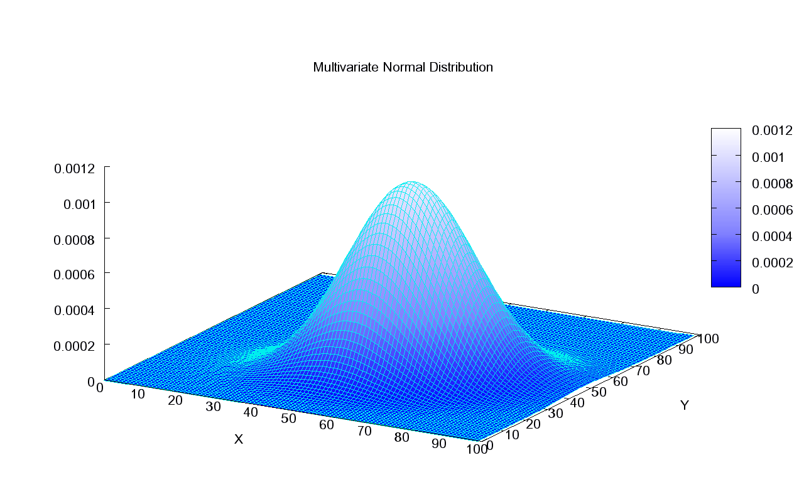

# 监督学习：GLA 生成式学习算法

本页统一记号：$m$ 表示样本数，$n$ 表示特征数；$x^{(i)}$ 表示第 $i$ 个样本，$x_j^{(i)}$ 表示第 $i$ 个样本的第 $j$ 列特征；$\hat y$ 表示预测值。

关联：[[概率论基础]]、[[监督学习-线性模型]]、[[矩阵基础]]

## 1. 生成式模型的想法

前面的线性回归、逻辑回归更偏判别式模型。判别式模型直接学习 $p(y\mid x)$ 或直接学习决策边界。

生成式模型的思路不同：它先研究数据是怎么生成的，也就是学习样本在不同类别下的分布概率。

以二分类为例，生成式模型会学习 $p(x\mid y=1)$、$p(x\mid y=0)$ 和 $p(y)$。

然后预测时再用贝叶斯公式把它们转成 $p(y\mid x)$。

直观上：

- 判别式模型问：给定 $x$，它属于哪一类？
- 生成式模型问：如果它属于某一类，那么生成这个 $x$ 的概率有多大？

## 2. 生成式模型如何预测

我们真正想预测的是 $p(y=1\mid x)$。

由贝叶斯公式，$p(y=1\mid x)=\frac{p(x\mid y=1)p(y=1)}{p(x)}$。

而 $p(x)$ 可以边缘化出来：$p(x)=p(x\mid y=1)p(y=1)+p(x\mid y=0)p(y=0)$。

因此：

$$
p(y=1\mid x)=\frac{p(x\mid y=1)p(y=1)}{p(x\mid y=1)p(y=1)+p(x\mid y=0)p(y=0)}
$$

所以生成式模型要学习：

- 类先验：$p(y=1)$ 和 $p(y=0)$。
- 类条件分布：$p(x\mid y=1)$ 和 $p(x\mid y=0)$。

学完这些以后，就可以用贝叶斯公式得到后验概率 $p(y=1\mid x)$。

## 3. 高斯判别分析 GDA

GDA，全称 Gaussian Discriminant Analysis，高斯判别分析，是一种生成式分类模型。



它对数据做如下假设：

- $y\sim Bernoulli(\phi)$。
- $x\mid y=0\sim\mathcal N(\mu_0,\Sigma)$。
- $x\mid y=1\sim\mathcal N(\mu_1,\Sigma)$。

这里 $\phi=p(y=1)$，$\mu_0$ 是负类样本的均值，$\mu_1$ 是正类样本的均值，$\Sigma$ 是协方差矩阵。

注意 GDA 假设两个类别使用同一个协方差矩阵 $\Sigma$。这点非常关键：共享 $\Sigma$ 会让最后的决策边界变成线性的。

多元高斯密度为：

$$
p(x;\mu,\Sigma)=\frac{1}{(2\pi)^{n/2}|\Sigma|^{1/2}}\exp\left(-\frac12(x-\mu)^T\Sigma^{-1}(x-\mu)\right)
$$

所以：

- $p(x\mid y=0)=\mathcal N(x;\mu_0,\Sigma)$。
- $p(x\mid y=1)=\mathcal N(x;\mu_1,\Sigma)$。

## 4. GDA 为什么会得到 sigmoid

我们从 $p(y=1\mid x;\phi,\mu_0,\mu_1,\Sigma)$ 出发。

直接写后验：

$p(y=1\mid x)=\frac{p(x\mid y=1)p(y=1)}{p(x\mid y=1)p(y=1)+p(x\mid y=0)p(y=0)}$。

令 $A=p(x\mid y=1)p(y=1)$，$B=p(x\mid y=0)p(y=0)$。

则 $p(y=1\mid x)=\frac{A}{A+B}=\frac{1}{1+B/A}$。

因此只要研究 $\log\frac{A}{B}$。

有 $\log\frac{A}{B}=\log\frac{p(x\mid y=1)p(y=1)}{p(x\mid y=0)p(y=0)}$。

展开为 $\log\frac{A}{B}=\log\frac{p(x\mid y=1)}{p(x\mid y=0)}+\log\frac{\phi}{1-\phi}$。

代入高斯密度。因为两类共享同一个 $\Sigma$，前面的归一化系数 $\frac{1}{(2\pi)^{n/2}|\Sigma|^{1/2}}$ 会抵消。

于是只剩指数部分：

$\log\frac{p(x\mid y=1)}{p(x\mid y=0)}=-\frac12(x-\mu_1)^T\Sigma^{-1}(x-\mu_1)+\frac12(x-\mu_0)^T\Sigma^{-1}(x-\mu_0)$。

展开第一项：

$(x-\mu_1)^T\Sigma^{-1}(x-\mu_1)=x^T\Sigma^{-1}x-2\mu_1^T\Sigma^{-1}x+\mu_1^T\Sigma^{-1}\mu_1$。

展开第二项：

$(x-\mu_0)^T\Sigma^{-1}(x-\mu_0)=x^T\Sigma^{-1}x-2\mu_0^T\Sigma^{-1}x+\mu_0^T\Sigma^{-1}\mu_0$。

两个 $x^T\Sigma^{-1}x$ 抵消，所以 $\log\frac{A}{B}$ 只剩线性项和常数项。

整理得到：

$$
\log\frac{A}{B}
=
(\mu_1-\mu_0)^T\Sigma^{-1}x+
\frac12\mu_0^T\Sigma^{-1}\mu_0
-\frac12\mu_1^T\Sigma^{-1}\mu_1
+\log\frac{\phi}{1-\phi}
$$

令 $\theta=\Sigma^{-1}(\mu_1-\mu_0)$。

令 $\theta_0=\frac12\mu_0^T\Sigma^{-1}\mu_0-\frac12\mu_1^T\Sigma^{-1}\mu_1+\log\frac{\phi}{1-\phi}$。

则 $\log\frac{A}{B}=\theta^Tx+\theta_0$。

因为 $p(y=1\mid x)=\frac{1}{1+B/A}$，而 $B/A=\exp(-\log(A/B))$。

所以：

$p(y=1\mid x)=\frac{1}{1+\exp(-(\theta^Tx+\theta_0))}$。

这就是 sigmoid 形式。

因此，GDA 虽然是生成式模型，但在共享协方差假设下，它最终也得到一个线性决策边界，形式上像逻辑回归。

## 5. GDA 参数的 MLE

GDA 的参数为 $\phi,\mu_0,\mu_1,\Sigma$。

训练数据为 $\{(x^{(i)},y^{(i)})\}_{i=1}^m$。

GDA 建模联合分布：$p(x,y)=p(x\mid y)p(y)$。

因此 likelihood 为

		$L(\phi,\mu_0,\mu_1,\Sigma)=\prod_{i=1}^m p(x^{(i)}\mid y^{(i)};\mu_0,\mu_1,\Sigma)p(y^{(i)};\phi)$。

取 log 得到 
		$\ell=\sum_{i=1}^m\log p(x^{(i)}\mid y^{(i)};\mu_0,\mu_1,\Sigma)+\sum_{i=1}^m\log p(y^{(i)};\phi)$。

先展开第一部分。多元高斯给出：

		$\log p(x^{(i)}\mid y^{(i)};\mu_0,\mu_1,\Sigma)=-\frac n2\log(2\pi)-\frac12\log|\Sigma|-\frac12(x^{(i)}-\mu_{y^{(i)}})^T\Sigma^{-1}(x^{(i)}-\mu_{y^{(i)}})$。

第二部分由 Bernoulli 分布给出：

		$\log p(y^{(i)};\phi)=y^{(i)}\log\phi+(1-y^{(i)})\log(1-\phi)$。

所以完整 log-likelihood 为：

$$
\ell
=
\sum_{i=1}^m
\left[
-\frac n2\log(2\pi)
-\frac12\log|\Sigma|
-\frac12(x^{(i)}-\mu_{y^{(i)}})^T\Sigma^{-1}(x^{(i)}-\mu_{y^{(i)}})
+y^{(i)}\log\phi
+(1-y^{(i)})\log(1-\phi)
\right]
$$

把和参数无关的 $-\frac n2\log(2\pi)$ 记为常数项，得到更适合求导的形式：

$$
\ell
=
-\frac m2\log|\Sigma|
-\frac12\sum_{i=1}^m
(x^{(i)}-\mu_{y^{(i)}})^T\Sigma^{-1}(x^{(i)}-\mu_{y^{(i)}})
+\sum_{i=1}^m y^{(i)}\log\phi
+\sum_{i=1}^m(1-y^{(i)})\log(1-\phi)
+const
$$

### $\phi$ 的 MLE

只看 $\ell$ 中和 $\phi$ 有关的部分：

$\ell(\phi)=\sum_i y^{(i)}\log\phi+\sum_i(1-y^{(i)})\log(1-\phi)$。

对 $\phi$ 求导：

$\frac{\partial \ell}{\partial\phi}=\sum_i\frac{y^{(i)}}{\phi}-\sum_i\frac{1-y^{(i)}}{1-\phi}$。

令导数为 0：

$\sum_i\frac{y^{(i)}}{\phi}=\sum_i\frac{1-y^{(i)}}{1-\phi}$。

两边交叉相乘：

$(1-\phi)\sum_i y^{(i)}=\phi\sum_i(1-y^{(i)})$。

展开并整理：

$\sum_i y^{(i)}=\phi m$。

所以 $\phi=\frac1m\sum_{i=1}^m y^{(i)}$。

也就是正例比例。

### $\mu_1$ 的 MLE

这里只推 $\mu_1$，$\mu_0$ 完全类似。

先写出 $\mu_{y^{(i)}}$ 的选择形式：$\mu_{y^{(i)}}=\mathbf{1}\{y^{(i)}=0\}\mu_0+\mathbf{1}\{y^{(i)}=1\}\mu_1$。

所以 $\frac{\partial\mu_{y^{(i)}}}{\partial\mu_1}=\mathbf{1}\{y^{(i)}=1\}$。
这一步不是隐式求导，而是因为标签 $y^{(i)}$ 已知，indicator 是常数。

只看 $\ell$ 中和 $\mu_1$ 有关的部分：

$\ell(\mu_1)=-\frac12\sum_i(x^{(i)}-\mu_{y^{(i)}})^T\Sigma^{-1}(x^{(i)}-\mu_{y^{(i)}})+const$。

对单项令 $q_i=(x^{(i)}-\mu_{y^{(i)}})^T\Sigma^{-1}(x^{(i)}-\mu_{y^{(i)}})$。

先对 $\mu_{y^{(i)}}$ 求导。因为 $\Sigma^{-1}$ 对称，$\nabla_{\mu_{y^{(i)}}}q_i=-2\Sigma^{-1}(x^{(i)}-\mu_{y^{(i)}})$。

再由链式法则，$\nabla_{\mu_1}q_i=\mathbf{1}\{y^{(i)}=1\}\left[-2\Sigma^{-1}(x^{(i)}-\mu_1)\right]$。

所以：

$\nabla_{\mu_1}\ell(\mu_1)=\sum_i\mathbf{1}\{y^{(i)}=1\}\Sigma^{-1}(x^{(i)}-\mu_1)$。

令梯度为 0：

$\sum_i\mathbf{1}\{y^{(i)}=1\}\Sigma^{-1}(x^{(i)}-\mu_1)=0$。

左乘 $\Sigma$：

$\sum_i\mathbf{1}\{y^{(i)}=1\}(x^{(i)}-\mu_1)=0$。

展开：

$\sum_i\mathbf{1}\{y^{(i)}=1\}x^{(i)}-\sum_i\mathbf{1}\{y^{(i)}=1\}\mu_1=0$。

因此：

$$
\mu_1=
\frac{\sum_i\mathbf{1}\{y^{(i)}=1\}x^{(i)}}{\sum_i\mathbf{1}\{y^{(i)}=1\}}
$$

类似地：

$$
\mu_0=
\frac{\sum_i\mathbf{1}\{y^{(i)}=0\}x^{(i)}}{\sum_i\mathbf{1}\{y^{(i)}=0\}}
$$

### $\Sigma$ 的 MLE

令 $\mu_{y^{(i)}}$ 表示按类别选择均值：若 $y^{(i)}=0$，则取 $\mu_0$；若 $y^{(i)}=1$，则取 $\mu_1$。

为了让求导更干净，令 $S=\Sigma^{-1}$，并令 $r_i=x^{(i)}-\mu_{y^{(i)}}$。

和 $\Sigma$ 有关的部分可以改写成关于 $S$ 的函数。因为 $\log|\Sigma|=-\log|S|$，所以：

$\ell(S)=\frac m2\log|S|-\frac12\sum_{i=1}^m r_i^TSr_i+const$。

把二次型写成 trace。因为 $r_i^TSr_i=\mathrm{tr}(r_i^TSr_i)=\mathrm{tr}(Sr_ir_i^T)$。

所以：

$\ell(S)=\frac m2\log|S|-\frac12\sum_{i=1}^m\mathrm{tr}(Sr_ir_i^T)+const$。

对 $S$ 求导。

由矩阵求导公式，$\nabla_S\log|S|=S^{-T}$。

又因为 $\nabla_S\mathrm{tr}(SA)=A^T$，且 $r_ir_i^T$ 对称，所以 $\nabla_S\mathrm{tr}(Sr_ir_i^T)=r_ir_i^T$。

因此：

$\nabla_S\ell(S)=\frac m2S^{-T}-\frac12\sum_{i=1}^m r_ir_i^T$。

令梯度为 0：

$\frac m2S^{-T}-\frac12\sum_i r_ir_i^T=0$。

两边乘以 2：

$mS^{-T}=\sum_i r_ir_i^T$。

因为 $S=\Sigma^{-1}$ 且 $\Sigma$ 对称，所以 $S^{-T}=\Sigma$。

因此：

$$
\Sigma=\frac1m\sum_{i=1}^m(x^{(i)}-\mu_{y^{(i)}})(x^{(i)}-\mu_{y^{(i)}})^T
$$

直觉是：每个样本都先减去自己所属类别的均值，然后把这些类内偏差的外积平均起来。因为 GDA 假设两类共享同一个协方差，所以所有样本都一起参与估计 $\Sigma$。

![[naive_bayes_classifier.gif|的核心假设]]


## 6. 决策边界

GDA 最终预测 $p(y=1\mid x)=\frac{1}{1+\exp(-(\theta^Tx+\theta_0))}$。

如果使用阈值 $0.5$ 分类，则决策边界满足 $p(y=1\mid x)=\frac12$。

因为 sigmoid 在输入为 0 时等于 $\frac12$，所以决策边界满足：

$\theta^Tx+\theta_0=0$。

这是一条线性边界。

也可以从 log odds 理解：当 $p(y=1\mid x)=p(y=0\mid x)$ 时，$\log\frac{p(y=1\mid x)}{p(y=0\mid x)}=0$，而这个 log odds 正好等于 $\theta^Tx+\theta_0$。

所以 GDA 的分类规则是：

- 若 $\theta^Tx+\theta_0\ge0$，预测 $y=1$。
- 若 $\theta^Tx+\theta_0<0$，预测 $y=0$。


## 7. GDA 代码部分

注意，训练时，不用加x0，不然会使得协方差矩阵第1列的方差全为0，非奇异。
在预测时再加入x0

```python
class GDA(LinearModel):
    """Gaussian Discriminant Analysis.

    Example usage:
        > clf = GDA()
        > clf.fit(x_train, y_train)
        > clf.predict(x_eval)
    """

    def fit(self, x, y):
        """Fit a GDA model to training set given by x and y.

        Args:
            x: Training example inputs. Shape (m, n).
            y: Training example labels. Shape (m,).

        Returns:
            theta: GDA model parameters.
        """

        # *** START CODE HERE ***

        fai=np.mean(y==1)

        #根据上图部分求
        u0=np.sum(x[y==0],axis=0)/np.sum(y==0)
        u1=np.sum(x[y==1],axis=0)/np.sum(y==1)
  
        m=y.shape[0]
        n=x.shape[1]
        sig=np.zeros((n,n))
        for i in range(m):
            if y[i]==0:
                u_y=u0
            else:
                u_y=u1
            z_i=(x[i]-u_y).reshape(-1,1)
            sig=sig+z_i@z_i.T

        sig=sig/m

        sig_neg=np.linalg.inv(sig)
        theta=sig_neg@((u1-u0).reshape(-1,1))#(n,1)

        theta_0=((u0-u1).reshape(-1,1)).T@sig_neg@((u1+u0).reshape(-1,1))/2-np.log((1-fai)/fai)

        #(1,1)

        self.theta=np.concatenate([[theta_0.item()],theta.flatten()])
        # *** END CODE HERE ***

    def predict(self, x):
        """Make a prediction given new inputs x.
        Args:
            x: Inputs of shape (m, n).
        Returns:
            Outputs of shape (m,).
        """
        # *** START CODE HERE ***
        f=x@self.theta
        pred=1/(1+np.exp(-f))
        return pred,(pred>=0.5).astype(int)
        # *** END CODE HERE
```

## 8. 朴素贝叶斯：为什么需要

朴素贝叶斯也是一种生成式学习算法。它和 GDA 一样，不是直接学习 $p(y\mid x)$，而是先学习 $p(x\mid y)$ 和 $p(y)$，再通过贝叶斯公式得到 $p(y\mid x)$。


但是朴素贝叶斯通常用于离散、高维、稀疏特征，最典型的例子就是文本分类。

假设我们要判断一封邮件是不是垃圾邮件。可以把邮件表示成一个二元特征向量 $x\in\{0,1\}^n$，其中 $x_j=1$ 表示第 $j$ 个词出现在邮件中，$x_j=0$ 表示没有出现。

类别记为 $y\in\{0,1\}$，例如 $y=1$ 表示垃圾邮件，$y=0$ 表示正常邮件。

按照生成式模型的思路，我们希望学习 $p(x\mid y=1)$、$p(x\mid y=0)$ 和 $p(y)$。

问题在于，$x$ 一共有 $2^n$ 种可能取值(因为他是离散的，不依赖参数)。

比如 $x=(0,0,\dots,0)$ 是一种取值，$x=(1,0,\dots,0)$ 是一种取值，$x=(0,1,\dots,0)$ 也是一种取值，一直到 $x=(1,1,\dots,1)$。

如果不做任何简化，想完整建模 $p(x\mid y=1)$，就要给每一种 $x$ 的组合分配一个概率。

因为所有概率之和必须等于 $1$，所以对固定类别 $y=1$，需要 $2^n-1$ 个自由参数。

同理，$p(x\mid y=0)$ 也需要 $2^n-1$ 个自由参数。

所以二分类时，光是 $p(x\mid y)$ 就大约需要 $2(2^n-1)$ 个参数，再加上类别先验 $p(y=1)$。

当 $n$ 是词表大小时，$n$ 往往非常大。文本分类里词表可能有几千、几万甚至更多词，如果直接估计完整的 $p(x\mid y)$，参数量会直接爆炸。

于是我们需要一个更强的假设来简化 $p(x\mid y)$。

朴素贝叶斯的核心假设是：在给定类别 $y$ 之后，各个特征 $x_j$ 条件独立。

也就是：

$p(x\mid y)=p(x_1,x_2,\dots,x_n\mid y)$。

在朴素贝叶斯假设下：

$p(x\mid y)=\prod_{j=1}^n p(x_j\mid y)$。

这一步就是“朴素”的来源。它并不是说现实中这些词真的互相独立，而是说：为了让模型可估计，我们假设在知道类别 $y$ 之后，每个词是否出现可以近似独立处理。

这样一来，我们不再需要枚举 $2^n$ 种完整的特征组合，而只需要分别估计每个词在某个类别下出现的概率。

对于二元特征 $x_j\in\{0,1\}$，我们只需要估计 $p(x_j=1\mid y=1)$ 和 $p(x_j=1\mid y=0)$。

因为 $p(x_j=0\mid y)=1-p(x_j=1\mid y)$，所以每个特征在每个类别下只需要一个参数。

于是参数量从指数级的 $2^n$ 降到了线性的 $n$。

直觉上：朴素贝叶斯牺牲了一部分特征相关性的表达能力，换来了非常便宜、非常稳定的估计方式。这也是它在文本分类里特别常见的原因。

## 9. 朴素贝叶斯的预测公式

我们真正想要的是 $p(y\mid x)$。

由贝叶斯公式，$p(y\mid x)=\frac{p(x\mid y)p(y)}{p(x)}$。

分类时，$p(x)$ 对所有类别都是同一个常数，所以只需要比较 $p(x\mid y)p(y)$。

因此：

$\hat y=\arg\max_y p(x\mid y)p(y)$。

代入朴素条件独立假设：

$\hat y=\arg\max_y p(y)\prod_{j=1}^n p(x_j\mid y)$。

实际计算中，很多小概率连乘容易造成数值下溢，所以通常取 log：

$\hat y=\arg\max_y \left[\log p(y)+\sum_{j=1}^n\log p(x_j\mid y)\right]$。

这个形式很重要：朴素贝叶斯最后比较的是“类别先验的 log 概率”加上“每个特征在该类别下的 log 概率贡献”。

## 10. Bernoulli Naive Bayes 的参数估计

对于二元文本特征，常用 Bernoulli Naive Bayes。

设 $\phi_y=p(y=1)$。

设 $\phi_{j\mid 1}=p(x_j=1\mid y=1)$，表示垃圾邮件中第 $j$ 个词出现的概率。

设 $\phi_{j\mid 0}=p(x_j=1\mid y=0)$，表示正常邮件中第 $j$ 个词出现的概率。

先看类别先验 $\phi_y$ 的 MLE。

因为 $y\sim Bernoulli(\phi_y)$，所以单个样本的类别概率是 $p(y^{(i)};\phi_y)=\phi_y^{y^{(i)}}(1-\phi_y)^{1-y^{(i)}}$。

所有样本的 likelihood 为
		$L(\phi_y)=\prod_{i=1}^m\phi_y^{y^{(i)}}(1-\phi_y)^{1-y^{(i)}}$。

取 log：

		$\ell(\phi_y)=\sum_{i=1}^m y^{(i)}\log\phi_y+\sum_{i=1}^m(1-y^{(i)})\log(1-\phi_y)$。

对 $\phi_y$ 求导：

$\frac{\partial\ell}{\partial\phi_y}=\sum_i\frac{y^{(i)}}{\phi_y}-\sum_i\frac{1-y^{(i)}}{1-\phi_y}$。

令导数为 $0$：

		$\sum_i\frac{y^{(i)}}{\phi_y}=\sum_i\frac{1-y^{(i)}}{1-\phi_y}$。

		$(1-\phi_y)\sum_i y^{(i)}=\phi_y\sum_i(1-y^{(i)})$。

		$\sum_i y^{(i)}-\phi_y\sum_i y^{(i)}=\phi_y\sum_i(1-y^{(i)})$。

		$\sum_i y^{(i)}=\phi_y\left[\sum_i y^{(i)}+\sum_i(1-y^{(i)})\right]$。

因为 $\sum_i y^{(i)}+\sum_i(1-y^{(i)})=m$，所以：

		$\phi_y=\frac{1}{m}\sum_{i=1}^m\mathbf{1}\{y^{(i)}=1\}$。

再看特征条件概率 $\phi_{j\mid 1}=p(x_j=1\mid y=1)$。

这里只需要看 $y^{(i)}=1$ 的样本，因为 $\phi_{j\mid 1}$ 只描述正类里面第 $j$ 个词是否出现。

在 $y=1$ 的条件下，$x_j$ 也是 Bernoulli 分布：

$p(x_j^{(i)}\mid y^{(i)}=1;\phi_{j\mid 1})=\phi_{j\mid 1}^{x_j^{(i)}}(1-\phi_{j\mid 1})^{1-x_j^{(i)}}$。

为了只选出正类样本，可以用 indicator 写 likelihood：

$L(\phi_{j\mid 1})=\prod_{i=1}^m\left[\phi_{j\mid 1}^{x_j^{(i)}}(1-\phi_{j\mid 1})^{1-x_j^{(i)}}\right]^{\mathbf{1}\{y^{(i)}=1\}}$。

取 log：

$\ell(\phi_{j\mid 1})=\sum_i\mathbf{1}\{y^{(i)}=1\}\left[x_j^{(i)}\log\phi_{j\mid 1}+(1-x_j^{(i)})\log(1-\phi_{j\mid 1})\right]$。

对 $\phi_{j\mid 1}$ 求导：

$\frac{\partial\ell}{\partial\phi_{j\mid 1}}=\sum_i\mathbf{1}\{y^{(i)}=1\}\frac{x_j^{(i)}}{\phi_{j\mid 1}}-\sum_i\mathbf{1}\{y^{(i)}=1\}\frac{1-x_j^{(i)}}{1-\phi_{j\mid 1}}$。

令导数为 $0$：

	$\sum_i\mathbf{1}\{y^{(i)}=1\}\frac{x_j^{(i)}}{\phi_{j\mid 1}}=\sum_i\mathbf{1}\{y^{(i)}=1\}\frac{1-x_j^{(i)}}{1-\phi_{j\mid 1}}$
	$(1-\phi_{j\mid 1})\sum_i\mathbf{1}\{y^{(i)}=1\}x_j^{(i)}=\phi_{j\mid 1}\sum_i\mathbf{1}\{y^{(i)}=1\}(1-x_j^{(i)})$
整理后得到：

	$\sum_i\mathbf{1}\{y^{(i)}=1\}x_j^{(i)}=\phi_{j\mid 1}\sum_i\mathbf{1}\{y^{(i)}=1\}$。

所以：

$\phi_{j\mid 1}=\frac{\sum_{i=1}^m\mathbf{1}\{x_j^{(i)}=1,y^{(i)}=1\}}{\sum_{i=1}^m\mathbf{1}\{y^{(i)}=1\}}$。
代表是正类样本，第j个词出现的概率

同理：

$\phi_{j\mid 0}=\frac{\sum_{i=1}^m\mathbf{1}\{x_j^{(i)}=1,y^{(i)}=0\}}{\sum_{i=1}^m\mathbf{1}\{y^{(i)}=0\}}$。

也就是：在某一类样本里，统计这个词出现的频率。

如果 $x_j=0$，则使用 $p(x_j=0\mid y)=1-p(x_j=1\mid y)$。

因此对一个样本 $x$，类别 $y=1$ 的 log score 可以写成：

$\log p(y=1)+\sum_{j=1}^n\left[x_j\log\phi_{j\mid 1}+(1-x_j)\log(1-\phi_{j\mid 1})\right]$。

类别 $y=0$ 同理：

$\log p(y=0)+\sum_{j=1}^n\left[x_j\log\phi_{j\mid 0}+(1-x_j)\log(1-\phi_{j\mid 0})\right]$。

最后比较两个 score，哪个更大就预测哪个类别。

## 11. 文本中的多类别版本

上面的 Bernoulli Naive Bayes 适合表示“某个词是否出现”。还有一种文本表示方式是：$x_j$ 表示文档中第 $j$ 个位置出现的是哪个词。

这时 $x_j$ 不再是 $0/1$，而是有 $K$ 个可能类别。若词表大小为 $K$，则 $x_j\in\{1,2,\dots,K\}$，其中 $x_j=k$ 表示第 $j$ 个位置上的词是词表中的第 $k$ 个词。

朴素贝叶斯仍然假设给定类别 $y$ 后，每个位置的词条件独立：

$p(x\mid y)=\prod_{j=1}^n p(x_j\mid y)$。

设 $\phi_{k\mid 1}=p(x_j=k\mid y=1)$，表示垃圾邮件中任意一个词位置出现第 $k$ 个词的概率。

设 $\phi_{k\mid 0}=p(x_j=k\mid y=0)$，表示正常邮件中任意一个词位置出现第 $k$ 个词的概率。

这里和 Bernoulli 版本不同：Bernoulli 的 $x_j$ 是“第 $j$ 个词是否出现”，而这里的 $x_j$ 是“第 $j$ 个位置出现了哪个词”。

对类别 $y=1$，likelihood 可以写成：

$L(\phi_{\cdot\mid 1})=\prod_{i:y^{(i)}=1}\prod_{j=1}^{n_i}\prod_{k=1}^K \phi_{k\mid 1}^{\mathbf{1}\{x_j^{(i)}=k\}}$。

其中 $n_i$ 表示第 $i$ 篇文档的词数。

取 log：

$\ell(\phi_{\cdot\mid 1})=\sum_{i:y^{(i)}=1}\sum_{j=1}^{n_i}\sum_{k=1}^K\mathbf{1}\{x_j^{(i)}=k\}\log\phi_{k\mid 1}$。

这个优化还有一个约束：$\sum_{k=1}^K\phi_{k\mid 1}=1$。

直观上，最大似然会把 $\phi_{k\mid 1}$ 估计成“正类文本中第 $k$ 个词出现的比例”：

$\phi_{k\mid 1}=\frac{\sum_{i:y^{(i)}=1}\sum_{j=1}^{n_i}\mathbf{1}\{x_j^{(i)}=k\}}{\sum_{i:y^{(i)}=1}n_i}$。要标签为1的邮件中出现了多少次k，除以标签为1的邮件的总次数。

同理：
$\phi_{k\mid 0}=\frac{\sum_{i:y^{(i)}=0}\sum_{j=1}^{n_i}\mathbf{1}\{x_j^{(i)}=k\}}{\sum_{i:y^{(i)}=0}n_i}$。

这就是文本分类里很常见的 Multinomial Naive Bayes：统计每个类别中各个词出现的频率。

如果某篇邮件中词表第 $k$ 个词出现了 $c_k$ 次，那么它对类别 $y=1$ 的 log score 贡献是 $c_k\log\phi_{k\mid 1}$。

所以整篇邮件的 score 可以写成：

$\log p(y=1)+\sum_{k=1}^K c_k\log\phi_{k\mid 1}$。

类别 $y=0$ 同理：

$\log p(y=0)+\sum_{k=1}^K c_k\log\phi_{k\mid 0}$。

最后比较两个 score，哪个更大就预测哪个类别。

## 12. Laplace 平滑

朴素贝叶斯里很常见的问题是零概率。

如果某个词在训练集中从来没有出现在垃圾邮件里，那么直接用 MLE 会得到 $p(x_j=1\mid y=1)=0$。

一旦测试邮件里出现了这个词，整个 $p(x\mid y=1)$ 就会被乘成 $0$。

这通常太极端，因为“训练集中没出现过”不等于“真实概率就是 0”。

所以需要 Laplace 平滑。

对 Bernoulli 特征，可以写成：

$\phi_{j\mid 1}=\frac{\sum_i\mathbf{1}\{x_j^{(i)}=1,y^{(i)}=1\}+1}{\sum_i\mathbf{1}\{y^{(i)}=1\}+2}$。

$\phi_{j\mid 0}=\frac{\sum_i\mathbf{1}\{x_j^{(i)}=1,y^{(i)}=0\}+1}{\sum_i\mathbf{1}\{y^{(i)}=0\}+2}$。

分母加 $2$ 是因为 Bernoulli 特征只有两种可能：$x_j=0$ 和 $x_j=1$。

对多类别文本版本，如果词表大小为 $K$，Laplace 平滑写成：

$\phi_{k\mid 1}=\frac{\sum_{i:y^{(i)}=1}\sum_j\mathbf{1}\{x_j^{(i)}=k\}+1}{\sum_{i:y^{(i)}=1}n_i+K}$。

$\phi_{k\mid 0}=\frac{\sum_{i:y^{(i)}=0}\sum_j\mathbf{1}\{x_j^{(i)}=k\}+1}{\sum_{i:y^{(i)}=0}n_i+K}$。

分母加 $K$ 是因为词表里一共有 $K$ 种可能的词。

## 13. 代码任务：垃圾短信分类器

这个任务使用 Multinomial Naive Bayes 完成 SMS spam classification。输入是一条短信文本，输出是 $y\in\{0,1\}$，其中 $y=1$ 表示 spam，$y=0$ 表示 not spam。

整体流程是：

```text
短信文本 -> 分词和归一化 -> 构建词典 -> 转换成词频矩阵 -> 训练 Naive Bayes -> 用 log score 预测类别 -> 找出最能指示 spam 的词
```

### 13.1 构建字典

第一步是把文本里的词变成可以被矩阵表示的特征。

对训练集中的每条 message 做分词和小写化。然后统计每个词出现在多少条 message 中。只保留出现在至少 5 条 message 中的词，并为每个词分配一个整数编号。

注意：这里统计的是“出现在多少条 message 中”，不是“总共出现多少次”。如果一个词在同一条短信里出现很多次，也只说明它出现在这一条 message 中。

可以写成：
$\mathrm{count}(w)=\sum_{i=1}^m\mathbf{1}\{w\in message^{(i)}\}$。

如果 $\mathrm{count}(w)\ge 5$，则把它加入 dictionary，并分配编号：
$dictionary[w]=k$。


```python
def get_words(message):
    
    return message.lower().split(" ")
   
def create_dictionary(messages):
    
    word_count={}
    #统计词语在多少个句子中出现过
    for message in messages:
        words=set(get_words(message))
        for word in words:
            word_count[word]=word_count.get(word,0)+1

    all_words=[]
    for message in messages:
        all_words+=get_words(message)
        
    i=0
    word_dict={}
    for word in set(all_words):
        if word_count[word]>=5:
            word_dict[word]=i
            i+=1
    return word_dict
```

### 13.2 文本转换成词频矩阵

设词典大小为 $K$，训练集有 $m$ 条短信。转换后得到矩阵 $X\in\mathbb R^{m\times K}$。

其中 $X_{ik}$ 表示第 $i$ 条短信中，第 $k$ 个词出现的次数。

每一行是一条短信，每一列是词典中的一个词。如果某个词不在 dictionary 中，就忽略。

这就是 bag-of-words 表示。它丢掉了词的顺序，只保留每个词出现了多少次。

代码位置：

```python
def transform_text(messages, word_dictionary):

    m=len(messages)
    size=len(word_dictionary)
    result=np.zeros((m,size))

    for i,message in enumerate(messages):
        word_list=get_words(message)
        for word in word_list:
            if word_dictionary.get(word)!=None:
                result[i][word_dictionary[word]]+=1
    return result

    # *** END CODE HERE ***
```

### 13.3 训练 Multinomial Naive Bayes

训练时要估计类别先验和词条件概率。

类别先验为：

$\phi_y=p(y=1)=\frac{\sum_i\mathbf{1}\{y^{(i)}=1\}}{m}$。

词条件概率为：

$\phi_{k\mid 1}=p(word=k\mid y=1)$。

使用 Laplace smoothing：

$\phi_{k\mid 1}=\frac{\sum_{i:y^{(i)}=1}X_{ik}+1}{\sum_{i:y^{(i)}=1}\sum_{j=1}^K X_{ij}+K}$。

同理：

$\phi_{k\mid 0}=\frac{\sum_{i:y^{(i)}=0}X_{ik}+1}{\sum_{i:y^{(i)}=0}\sum_{j=1}^K X_{ij}+K}$。

分子是某个词在该类别中出现的次数加 1。分母是该类别中所有词出现次数加 $K$。这里的 $K$ 是词典大小，因为 Laplace smoothing 给每个词都加了一个虚拟计数。


```python
def fit_naive_bayes_model(matrix, labels):

    k=matrix.shape[1]

    state={}

    spam = matrix[labels==1]
    ham=matrix[labels==0]

    state["y=1"]=np.mean(labels)
    state["y=0"]=1-state["y=1"]

    state["phi_k_y1"]=(spam.sum(axis=0)+1)/(spam.sum()+k)
    state["phi_k_y0"]=(ham.sum(axis=0)+1)/(ham.sum()+k)
    
    return state
```

### 13.4 预测：为什么要用 log score

对一条短信，其词频向量为 $x$。

朴素贝叶斯比较：

$p(y=1\mid x)\propto p(y=1)p(x\mid y=1)$。

在 multinomial event model 下：

$p(y=1)p(x\mid y=1)=\phi_y\prod_{k=1}^K\phi_{k\mid 1}^{x_k}$。

但直接计算这个连乘会有 underflow 问题。因为每个 $\phi_{k\mid 1}$ 都小于 1，很多小概率相乘会得到极小值，计算机可能直接把它当成 0。

所以预测时改用 log score：

$score_1=\log\phi_y+\sum_{k=1}^K x_k\log\phi_{k\mid 1}$。

$score_0=\log(1-\phi_y)+\sum_{k=1}^K x_k\log\phi_{k\mid 0}$。

如果 $score_1>score_0$，则预测 $\hat y=1$；否则预测 $\hat y=0$。

这里要注意：问题来自“很多概率连乘”，不是阶乘。


```python
def predict_from_naive_bayes_model(model, matrix):
    pred_y1=np.log(model["y=1"])+matrix@np.log(model["phi_k_y1"])
    pred_y0=np.log(model["y=0"])+matrix@np.log(model["phi_k_y0"])

    return (pred_y1>pred_y0).astype(int)
    
```

### 13.5 找出最有指示性的五个词

题目使用 log ratio 衡量一个词对 spam 类别的指示性：

$indicator(k)=\log\frac{p(word=k\mid y=1)}{p(word=k\mid y=0)}$。

也就是：

$indicator(k)=\log\phi_{k\mid 1}-\log\phi_{k\mid 0}$。

这个值越大，说明词 $k$ 在 spam 中相对更常见，而在 not spam 中相对更少见，因此它越能指示 spam 类别。

对所有词计算 $indicator(k)$，排序后取最大的 5 个词即可。
这里构建了一个反向字典


```python
def get_top_five_naive_bayes_words(model, dictionary):
    
    result=np.log(model["phi_k_y1"])-np.log(model["phi_k_y0"])

    result_idx=[idx for idx,val in sorted(enumerate(result),key=lambda x:x[1],reverse=True)][:5]

  
    idx_to_word={idx:word for word,idx in dictionary.items()}
    return [idx_to_word[idx] for idx in result_idx]
```

### 13.6 代码和公式的对应关系

- `create_dictionary` 对应词表 $V$。
- `transform_text` 对应构造词频矩阵 $X$。
- `fit_naive_bayes_model` 对应估计 $\phi_y,\phi_{k\mid 1},\phi_{k\mid 0}$。
- `predict_from_naive_bayes_model` 对应比较 $score_1$ 和 $score_0$。
- `get_top_five_naive_bayes_words` 对应计算 $\log\frac{\phi_{k\mid 1}}{\phi_{k\mid 0}}$。

这段代码的重点不是复杂模型，而是把文本一步步转换成可以套用朴素贝叶斯公式的矩阵表示。

## 14. 和 GDA、逻辑回归的关系

GDA 和朴素贝叶斯都是生成式模型，都学习 $p(x\mid y)$ 和 $p(y)$，再通过贝叶斯公式得到 $p(y\mid x)$。

区别在于它们对 $p(x\mid y)$ 的假设不同。

GDA 假设 $x\mid y$ 服从高斯分布，并且两个类别共享协方差矩阵 $\Sigma$。

朴素贝叶斯假设给定 $y$ 后，各个特征 $x_j$ 条件独立。

逻辑回归则是判别式模型，它直接学习 $p(y\mid x)$，不需要显式建模 $p(x\mid y)$。

一个常见理解是：生成式模型假设更强(假设了数据的分布情况)，数据少时可能更容易估计；判别式模型假设更少，数据足够时通常上限更高。

以后看到文本分类、词袋特征、条件独立假设、很多离散特征时，可以优先想到朴素贝叶斯。
