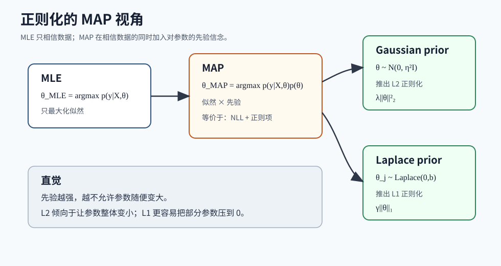
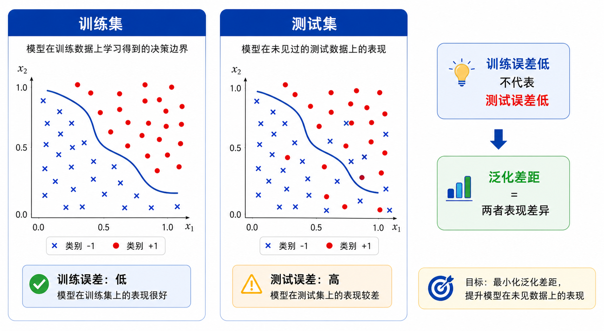
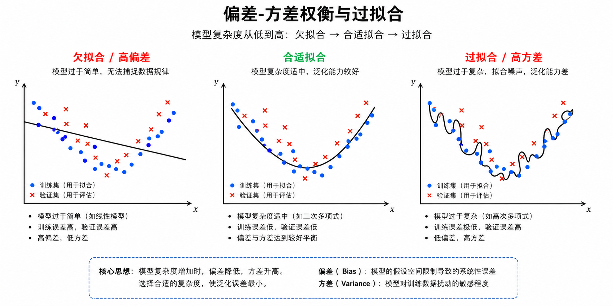
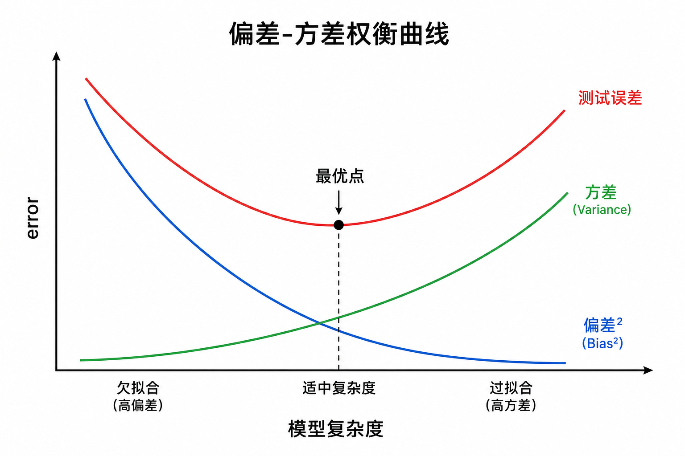
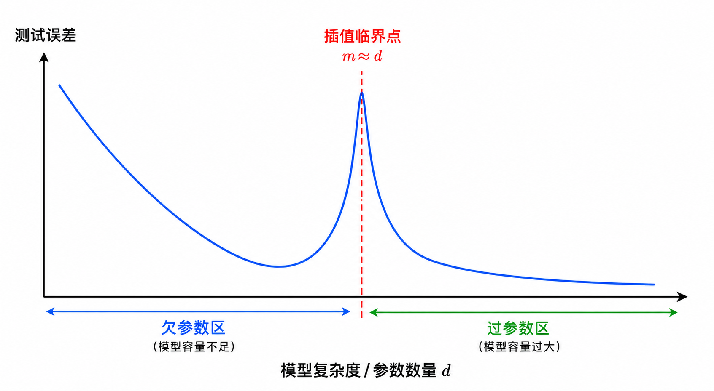
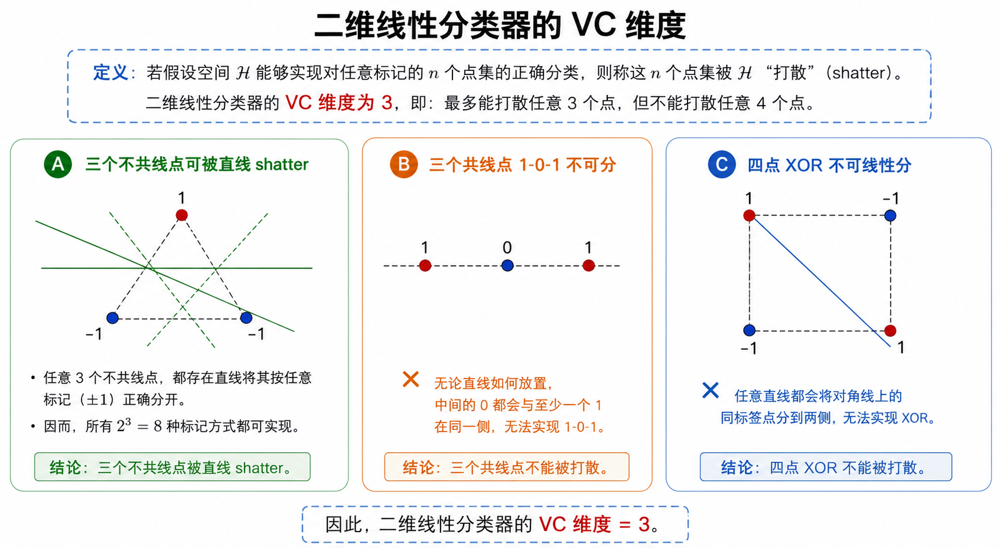

# 监督学习：正则化、泛化与交叉验证

本页统一记号：$m$ 表示样本数，$n$ 表示特征数；$x^{(i)}$ 表示第 $i$ 个样本，$x_j^{(i)}$ 表示第 $i$ 个样本的第 $j$ 列特征；$\hat y$ 表示预测值。

关联：[[监督学习-线性模型]]、[[监督学习-GLM与指数族]]、[[概率论基础]]、[[矩阵基础]]

# 正则化
## 1. 从频率学派和贝叶斯学派引入正则化

在机器学习里，我们经常要学习一个参数 $\theta$。比如线性回归里的 $\theta$，逻辑回归里的 $\theta$，本质上都是模型用来解释数据的参数。

对于“参数 $\theta$ 到底是什么”，频率学派和贝叶斯学派的看法不一样。

频率学派认为：参数 $\theta$ 是一个固定但未知的值。数据是随机采样得到的，参数本身不是随机变量。

所以频率学派学习参数时，关心的是：是否存在某个固定的 $\theta$，使得当前观测到的数据最可能出现？

这就自然得到最大似然估计 MLE：

$\theta_{MLE}=\arg\max_\theta p(y\mid X,\theta)$。

它问的是：如果参数是 $\theta$，那么现在这批数据 $y$ 出现的概率有多大？

所以 MLE 只相信数据本身。它不提前偏好某一类参数，只要某个 $\theta$ 能让训练数据的似然最大，就会选择它。

贝叶斯学派的看法不同。贝叶斯学派认为：参数 $\theta$ 也可以看成随机变量。

既然 $\theta$ 是随机变量，那么在看到数据之前，我们就可以先给它一个先验分布 $p(\theta)$，表达我们对参数的先验信念。

比如，我们可能认为参数不应该太大。这个信念可以写成零均值高斯先验：$\theta\sim\mathcal N(0,\eta^2I)$。

看到数据之后，我们不再只看似然 $p(y\mid X,\theta)$，还要看后验概率 $p(\theta\mid X,y)$。

这就得到最大后验估计 MAP：

$\theta_{MAP}=\arg\max_\theta p(\theta\mid X,y)$。

由贝叶斯公式：

$p(\theta\mid X,y)=\frac{p(y\mid X,\theta)p(\theta\mid X)}{p(y\mid X)}$。

如果模型没有显式建模 $X$ 的生成过程，通常可以假设 $\theta$ 和 $X$ 边缘独立，因此 $p(\theta\mid X)=p(\theta)$。

所以：

$p(\theta\mid X,y)=\frac{p(y\mid X,\theta)p(\theta)}{p(y\mid X)}$。

因为 $p(y\mid X)$ 对 $\theta$ 来说是常数，所以最大化后验时可以丢掉它：

$\theta_{MAP}=\arg\max_\theta p(y\mid X,\theta)p(\theta)$。

取 log 后：

$\theta_{MAP}=\arg\max_\theta \left[\log p(y\mid X,\theta)+\log p(\theta)\right]$。

如果改写成最小化问题：

$\theta_{MAP}=\arg\min_\theta \left[-\log p(y\mid X,\theta)-\log p(\theta)\right]$。

这里 $-\log p(y\mid X,\theta)$ 是负对数似然 NLL，$-\log p(\theta)$ 就是由先验带来的正则化项。

因此，正则化不是凭空加上的数学技巧，而是可以被理解成贝叶斯视角下的参数先验。

核心对应关系是: $\text{MAP}=\text{NLL}+\text{由先验推出的惩罚项}$。

总结下来就是，MLE 问的是“哪个参数最能解释数据”；MAP 问的是“哪个参数既能解释数据，本身又符合我们对参数的先验信念”。

## 2. 高斯先验推出 L2 正则化

假设参数服从零均值高斯分布：$\theta\sim\mathcal N(0,\eta^2 I)$。

这里 $\eta^2 I$ 表示每个参数的方差都是 $\eta^2$，并且不同参数之间先验上相互独立。

高斯先验密度为：
				$p(\theta)=\frac{1}{(2\pi)^{n/2}\eta^n}\exp\left(-\frac{1}{2\eta^2}\theta^T\theta\right)$
				
				$\log p(\theta)=\log\frac{1}{(2\pi)^{n/2}\eta^n}-\frac{1}{2\eta^2}\theta^T\theta$。

第一项与 $\theta$ 无关，记为常数 $C$：

				$\log p(\theta)=C-\frac{1}{2\eta^2}\|\theta\|_2^2$。

代入 MAP 的最小化形式：

				$\theta_{MAP}=\arg\min_\theta\left[-\log p(y\mid X,\theta)-\log p(\theta)\right]$。

于是$\theta_{MAP}=\arg\min_\theta\left[-\log p(y\mid X,\theta)-C+\frac{1}{2\eta^2}\|\theta\|_2^2\right]$。

因为常数 $C$ 不影响最优解，所以$\theta_{MAP}=\arg\min_\theta\left[-\log p(y\mid X,\theta)+\frac{1}{2\eta^2}\|\theta\|_2^2\right]$。

这就是 L2 正则化。

如果把正则化强度写成 $\lambda$，则 $\lambda=\frac{1}{2\eta^2}$。

直觉上，$\eta^2$ 越小，先验越相信参数应该靠近 $0$，因此 $\lambda$ 越大，正则化越强。

L2 正则化的典型形式是：$J_{reg}(\theta)=J(\theta)+\lambda\|\theta\|_2^2$。

它倾向于让所有参数整体变小，但通常不会把大量参数精确压成 $0$。

## 3. 拉普拉斯先验推出 L1 正则化

如果希望参数更稀疏，也就是很多参数直接变成 $0$，常见做法是使用 L1 正则化。

从贝叶斯角度看，L1 正则化对应的是拉普拉斯先验 Laplace prior。

一维拉普拉斯分布为：

$p(\theta_j)=\frac{1}{2b}\exp\left(-\frac{|\theta_j|}{b}\right)$。

假设每个参数独立同分布$p(\theta)=\prod_{j=1}^n p(\theta_j)$。

代入拉普拉斯密度:  $p(\theta)=\prod_{j=1}^n \frac{1}{2b}\exp\left(-\frac{|\theta_j|}{b}\right)$。
				$\log p(\theta)=\sum_{j=1}^n \left[\log\frac{1}{2b}-\frac{|\theta_j|}{b}\right]$。

把常数项记为 $C$：

				$\log p(\theta)=C-\frac{1}{b}\sum_{j=1}^n|\theta_j|$。

				$\log p(\theta)=C-\frac{1}{b}\|\theta\|_1$。

代入 MAP 的最小化形式：

$\theta_{MAP}=\arg\min_\theta\left[-\log p(y\mid X,\theta)-\log p(\theta)\right]$。

于是 $\theta_{MAP}=\arg\min_\theta\left[-\log p(y\mid X,\theta)-C+\frac{1}{b}\|\theta\|_1\right]$。

丢掉常数项 $\theta_{MAP}=\arg\min_\theta\left[-\log p(y\mid X,\theta)+\frac{1}{b}\|\theta\|_1\right]$。

这就是 L1 正则化，如果把正则化强度写成 $\lambda$，则 $\lambda=\frac{1}{b}$。

直觉上，$b$ 越小，拉普拉斯分布越尖，越强烈地相信参数应该靠近 $0$，因此正则化越强。

L1 正则化的典型形式是：$J_{reg}(\theta)=J(\theta)+\lambda\|\theta\|_1$。

它更容易产生稀疏解，也就是让一部分参数变成 $0$。这也是 Lasso 回归常用于特征选择的原因。

## 4. L1 与 L2 的对比

L2 正则化来自高斯先验：$\theta\sim\mathcal N(0,\eta^2I)$。

它的惩罚项是 $\|\theta\|_2^2=\sum_j\theta_j^2$。

它的效果是让参数整体缩小，减少模型对单个特征的过度依赖。

L1 正则化来自拉普拉斯先验：$\theta_j\sim Laplace(0,b)$。

它的惩罚项是 $\|\theta\|_1=\sum_j|\theta_j|$。

它的效果是让参数稀疏，一些不重要的特征对应的参数可能被压到 $0$。

一个速记：

- 高斯先验 $\rightarrow$ L2 正则化 $\rightarrow$ 参数整体变小。
- 拉普拉斯先验 $\rightarrow$ L1 正则化 $\rightarrow$ 参数更稀疏。

# 泛化

## 5. 泛化问题的提出

正则化真正关心的不是让训练误差最低，而是让模型在未见过的新数据上更可靠。

在监督学习中，训练集记为 $S=\{(x^{(i)},y^{(i)})\}_{i=1}^m$。

学习算法通常通过最小化训练损失得到模型。例如平方损失可以写成 $\hat L(\theta)=\frac{1}{m}\sum_{i=1}^m(y^{(i)}-h_\theta(x^{(i)}))^2$。

这个损失也叫 training loss、empirical loss 或 training error。它衡量的是模型在已见样本上的表现。

但机器学习的最终目标不是让模型背熟训练集，而是让模型在未见过的新样本上也表现好。

如果新样本来自真实分布 $\mathcal D$，即 $(x,y)\sim\mathcal D$，那么测试误差可以写成 $L(\theta)=\mathbb E_{(x,y)\sim\mathcal D}[(y-h_\theta(x))^2]$。

训练误差和测试误差的差距称为 generalization gap：$\text{generalization gap}=L(\theta)-\hat L(\theta)$。

泛化部分要回答的核心问题是：

> 当模型在训练集上表现好时，什么时候可以相信它在测试集上也表现好？

## 6. 泛化分析的基本假设：IID(独立分布假设)

泛化理论通常依赖一个核心假设：训练样本和测试样本都来自同一个真实分布 $\mathcal D$，并且训练样本是独立同分布采样的。

写成公式就是 $(x^{(i)},y^{(i)})\overset{i.i.d.}{\sim}\mathcal D$。

iid 包含两层意思：

- independent：样本与样本之间相互独立。
- identically distributed：样本来自同一个分布。

注意，这里的“独立”是说样本与样本之间独立，不是说特征之间独立。

例如房价数据中，面积、地段、房龄这些特征可以相关；这不影响 iid 假设。iid 关注的是 $(x^{(1)},y^{(1)})$ 和 $(x^{(2)},y^{(2)})$ 是否可以看成从同一个世界里独立抽出来的两个样本。

如果训练集和测试集不来自同一分布，就会出现 distribution shift 或 domain shift。

例如，用白天高清图像训练自动驾驶模型，却在夜晚雨天场景测试，此时训练误差就很难代表测试误差。

如果样本不独立，比如训练集和测试集来自同一个视频的连续帧，那么测试集可能包含和训练集几乎重复的信息，导致测试误差虚假偏低。

但 iid 只是泛化分析的前提，不是泛化好的充分条件。

即使训练集和测试集 iid，模型是否泛化仍然取决于模型复杂度、样本数量、噪声大小、正则化、优化过程和特征质量。

## 7. 过拟合与欠拟合

假设真实数据生成过程为 $y=h^*(x)+\xi$。

其中 $h^*(x)$ 是真实函数，$\xi$ 是噪声，常见假设是 $\xi\sim\mathcal N(0,\sigma^2)$。

### 7.1 欠拟合：模型太简单

如果真实函数 $h^*(x)$ 是二次函数，但我们使用线性模型 $h_\theta(x)=\theta_0+\theta_1x$，那么不管训练数据有多少，线性模型都无法真正表达二次函数。

这时训练误差大，测试误差也大。这种情况叫 underfitting，通常对应 high bias。

本质原因是：模型假设类太简单，表达能力不足。

### 7.2 过拟合：模型太复杂

如果我们使用五次多项式 $h_\theta(x)=\theta_0+\theta_1x+\theta_2x^2+\theta_3x^3+\theta_4x^4+\theta_5x^5$，它当然可以表示二次函数，因为令 $\theta_3=\theta_4=\theta_5=0$ 就能退化成二次函数。

所以五次多项式的表达能力足够强，bias 不一定大。

但如果训练数据较少且包含噪声，五次多项式可能为了拟合训练集中的噪声而变得非常弯曲。

于是它在训练集上误差很低，但在测试集上误差很高。这种情况叫 overfitting，通常对应 high variance。

本质原因是：模型过于灵活，对有限训练集中的随机噪声过于敏感。

## 8. Bias-Variance Decomposition

偏差-方差分解试图回答：测试误差到底由哪些部分组成？

考虑测试点 $x$ 处的预测误差。真实标签为 $y=h^*(x)+\xi$。

在训练集 $S$ 上训练出的模型记为 $\hat h_S$。

这里的下标 $S$ 很重要，它表示模型依赖训练集。换一批训练集，学出来的模型可能不同。

定义测试点 $x$ 处的均方误差：$\mathrm{MSE}(x)=\mathbb E_{S,\xi}[(y-\hat h_S(x))^2]$。

这里期望对两部分随机性取：训练集 $S$ 的随机性，以及测试噪声 $\xi$ 的随机性。

第一步，代入真实数据生成过程。

$y-\hat h_S(x)=\xi+h^*(x)-\hat h_S(x)$。

$\mathrm{MSE}(x)=\mathbb E_{S,\xi}[(\xi+h^*(x)-\hat h_S(x))^2]$。

由于噪声 $\xi$ 均值为 $0$，并且和训练集 $S$ 独立，可以将噪声项拆出来：

$\mathrm{MSE}(x)=\sigma^2+\mathbb E_S[(h^*(x)-\hat h_S(x))^2]$。

其中 $\sigma^2$ 是不可避免的噪声误差。因为噪声本身无法被预测，所以这一项无法通过模型改进消除。

第二步，引入平均模型。

定义 $h_{\mathrm{avg}}(x)=\mathbb E_S[\hat h_S(x)]$。

它表示：如果反复抽取很多个训练集，每个训练集都训练一个模型，然后把这些模型在 $x$ 处的预测取平均。

这个平均模型现实中无法直接得到，因为我们不可能拥有无限多个训练集。它主要用于理论分析。

把 $h_{\mathrm{avg}}(x)$ 加进去并整理，$h^*(x)-h_{\mathrm{avg}}(x)$ 是一个常数，可以再提出来

$\mathrm{MSE}(x)=\sigma^2+\left(h^*(x)-h_{\mathrm{avg}}(x)\right)^2+\mathbb E_S[(h_{\mathrm{avg}}(x)-\hat h_S(x))^2]$。

也就是 $\mathrm{MSE}(x)=\text{Noise}+\text{Bias}^2+\text{Variance}$。

Noise 是 $\sigma^2$，来自数据本身的随机噪声，模型无法消除。

Bias² 是 $\left(h^*(x)-h_{\mathrm{avg}}(x)\right)^2$，衡量平均模型和真实函数之间的差距，如果平均模型都远离真实函数，说明模型族本身表达能力不足，对应 high bias。

Variance 是 $\mathbb E_S[(h_{\mathrm{avg}}(x)-\hat h_S(x))^2]$，衡量不同训练集训练出的模型之间的波动程度。

如果换一批训练集，模型预测变化很大，说明模型对训练集随机性非常敏感，对应 high variance。

## 9. Bias-Variance Tradeoff

根据偏差-方差分解，测试误差可以理解为 $\text{Noise}+\text{Bias}^2+\text{Variance}$。

随着模型复杂度增加，通常会出现以下趋势：

- 模型表达能力增强，bias 下降。
- 模型对数据更敏感，variance 上升。
- 测试误差可能先下降后上升。

如果模型太简单，bias 高、variance 低、训练误差高、测试误差高，对应欠拟合。

如果模型太复杂，bias 低、variance 高、训练误差低、测试误差高，对应过拟合。

合适的模型复杂度应该在 bias 和 variance 之间取得平衡，使测试误差较低。

## 10. 现代补充：Double Descent

传统 bias-variance tradeoff 通常认为，测试误差随着模型复杂度增加呈 U 型曲线。

但现代机器学习中，尤其是在过参数模型中，经常观察到 double descent 现象：测试误差可能先下降，然后上升，进入过参数区域后又再次下降。

在 model-wise double descent 中，固定训练样本数量 $m$，增加模型参数数量 $d$。

当 $d<m$ 时，模型表达能力有限，可能欠拟合。随着参数增加，bias 下降，测试误差降低。

当 $d\approx m$ 时，模型刚好有能力将训练集拟合到接近零训练误差。这个位置常被称为 interpolation threshold。在这个区域，模型可能为了穿过所有带噪声训练点而变得非常不稳定，参数 norm 可能变大，variance 也可能升高，因此测试误差出现峰值。

当 $d\gg m$ 时，参数数量远大于样本数量，能够拟合训练集的解有很多个。优化器可能通过隐式正则化偏向某些更简单的解，例如最小范数解。

因此，测试误差可能再次下降。

Double descent 的关键直觉是：最危险的地方不是模型最简单，也不是模型最大，而是模型刚好能插值训练集的临界点附近。

当 $d\approx m$ 时，模型刚好有能力拟合训练集，但解可能非常不稳定，对噪声极其敏感。

当 $d\gg m$ 时，虽然模型过参数，但可行解很多，优化器可能选择更稳定、更小范数的解，因此泛化反而可能改善。

## 11. 验证集与交叉验证

训练误差不能直接用来判断泛化，因为训练误差是模型优化时已经看过的数据。

测试集也不能反复用来调参。否则测试集会变成另一种训练集，测试误差会被高估得太乐观。

因此实际机器学习通常把数据分成三部分：

- training set：用于训练参数 $\theta$。
- validation set：用于选择超参数，例如正则化强度 $\lambda$、多项式阶数、树深度、kernel radius。
- test set：只在最后使用一次，用来估计最终泛化性能。

这里要区分参数和超参数。

参数是模型通过训练学出来的，比如线性回归中的 $\theta$。

超参数是训练前人为设定、通常要用验证集选择的量，比如学习率、正则化强度 $\lambda$、模型复杂度等。

如果数据量较少，可以使用 k-fold cross validation。
![[K折交叉验证.png|Pasted image 20260526135456.png]]

k-fold 的做法是：把训练数据分成 $k$ 份，每次用其中 $k-1$ 份训练，用剩下一份验证，重复 $k$ 次，最后把 $k$ 次验证误差取平均。

例如 5-fold cross validation 会训练 5 次，每次轮流拿一折做验证集。

交叉验证的作用是：在不浪费太多数据的情况下，更稳定地估计某组超参数的验证表现。用法上，通常会对一组候选超参数分别做交叉验证，然后选择平均验证误差最低的那组。

如果说数据特别小的话，可以用留意法，即每次只选出一个样本做验证，k=样本数m。

注意，交叉验证选择完超参数后，最终仍然应该在独立 test set 上做一次最终评估。

## 12. ERM 与泛化理论

前面的 bias-variance 分解主要解释测试误差由哪些部分构成。学习理论进一步问：为什么训练误差小，可以推出泛化误差小？

对于二分类问题，设 $y\in\{0,1\}$，训练集为 $S=\{(x^{(i)},y^{(i)})\}_{i=1}^m$。

对于一个分类器 $h$：

训练误差定义为 $\hat\epsilon(h)=\frac{1}{m}\sum_{i=1}^m1\{h(x^{(i)})\neq y^{(i)}\}$，即模型在已见训练集上的错误率
泛化误差定义为 $\epsilon(h)=P_{(x,y)\sim\mathcal D}(h(x)\neq y)$，即模型在真实分布中新样本上的错误概率

假设类 $H$ 是学习算法允许自己从中选择的所有候选模型集合。

例如线性分类器的假设类可以写成 $H=\{h_\theta:h_\theta(x)=1\{\theta^Tx\ge 0\},\theta\in\mathbb R^{n+1}\}$。

经验风险最小化 ERM 定义为 $\hat h=\arg\min_{h\in H}\hat\epsilon(h)$，也就是从在假设类 $H$ 中选择训练误差最小的模型，$\hat h$ 是根据训练集选出来的，因此它不是一个提前固定的模型。它可能会受到训练集随机性的影响。

## 13. 有限假设类下的泛化保证

先考虑有限假设类 $H=\{h_1,h_2,\dots,h_k\}$，其中一共有 $k$ 个候选分类器。

对某个固定模型 $h_i$，定义 $Z_j=1\{h_i(x^{(j)})\neq y^{(j)}\}$，如果第 $j$ 个样本被分错，则 $Z_j=1$；否则 $Z_j=0$。

训练误差可以写成 $\hat\epsilon(h_i)=\frac{1}{m}\sum_{j=1}^m Z_j$，而泛化误差是 $\epsilon(h_i)=\mathbb E[Z_j]$。

因此，训练误差是对泛化误差的样本平均估计。

使用 Hoeffding 不等式可得 $P(|\epsilon(h_i)-\hat\epsilon(h_i)|>\gamma)\le 2\exp(-2\gamma^2m)$。

这说明，对一个固定模型，只要样本数足够大，训练误差大概率接近泛化误差，但 ERM 选出来的模型 $\hat h$ 不是提前固定的，而是看了训练集之后才选出来的。

如果只保证某一个固定模型的训练误差接近泛化误差，并不能保证 ERM 选出的模型可靠。因为 ERM 可能选中的是某个在训练集上碰巧表现很好的模型。

因此，我们需要证明 $\forall h\in H,\ |\epsilon(h)-\hat\epsilon(h)|\le\gamma$。

这叫 uniform convergence，即一致收敛。

它表示：对假设类 $H$ 中所有模型，训练误差都同时接近泛化误差。

对每个模型 $h_i$，定义坏事件 $A_i=\{|\epsilon(h_i)-\hat\epsilon(h_i)|>\gamma\}$。

根据 Hoeffding 不等式，$P(A_i)\le 2\exp(-2\gamma^2m)$。

使用 union bound：$P(A_1\cup A_2\cup\cdots\cup A_k)\le \sum_{i=1}^kP(A_i)$。

所以 $P(\exists h\in H,\ |\epsilon(h)-\hat\epsilon(h)|>\gamma)\le 2k\exp(-2\gamma^2m)$。

反过来，$P(\forall h\in H,\ |\epsilon(h)-\hat\epsilon(h)|\le\gamma)\ge 1-2k\exp(-2\gamma^2m)$。

union bound 的作用是：把“单个模型可靠”，升级成“整个假设类里的模型同时可靠”。

如果希望失败概率不超过 $\delta$，则令 $2k\exp(-2\gamma^2m)\le\delta$。

解得 $m\ge \frac{1}{2\gamma^2}\log\frac{2k}{\delta}$。

这个样本数规模叫 sample complexity。

它说明有限假设类中，需要的样本数与候选模型数量 $k$ 呈对数关系：$m=O(\frac{1}{\gamma^2}\log\frac{k}{\delta})$。

## 14. ERM 的泛化误差界

令 $h^*=\arg\min_{h\in H}\epsilon(h)$，$h^*$ 表示假设类 $H$ 中真实泛化误差最小的模型。它是理论上的最优模型，现实中通常不知道。

ERM 选出的模型为 $\hat h=\arg\min_{h\in H}\hat\epsilon(h)$，如果一致收敛成立，则 $\epsilon(\hat h)\le\hat\epsilon(\hat h)+\gamma$。即$\hat h$的泛化误差不会比训练误差+γ还要大。

因为 $\hat h$ 是训练误差最小的模型，所以 $\hat\epsilon(\hat h)\le\hat\epsilon(h^*)$。

又因为一致收敛也对 $h^*$ 成立，所以 $\hat\epsilon(h^*)\le\epsilon(h^*)+\gamma$，即$h^{*}$在训练集上的误差不会比真实泛化误差+γ还要大。

连起来得到 $\epsilon(\hat h)\le\epsilon(h^*)+2\gamma$。

这说明：只要一致收敛成立，ERM 选出来的模型，其泛化误差最多比假设类内真实最优模型差 $2\gamma$。

进一步可以写成 $\epsilon(\hat h)\le\min_{h\in H}\epsilon(h)+2\sqrt{\frac{1}{2m}\log\frac{2k}{\delta}}$。

第一项 $\min_{h\in H}\epsilon(h)$ 表示假设类 $H$ 中最好的模型能做到多好。如果 $H$ 太简单，这一项可能很大，对应 high bias。

第二项 $2\sqrt{\frac{1}{2m}\log\frac{2k}{\delta}}$ 表示由于假设类包含多个候选模型，ERM 可能选到训练集上“碰巧好”的模型所带来的泛化风险。

$H$ 越大，$k$ 越大，这一项越大，对应 variance 或 overfitting risk。

## 15. 无限假设类与 VC Dimension

现实中很多假设类是无限的，例如线性分类器 $H=\{h_\theta:h_\theta(x)=1\{\theta^Tx\ge 0\},\theta\in\mathbb R^{n+1}\}$。

因为 $\theta$ 是连续实数向量，所以 $H$ 中有无穷多个函数。此时不能直接使用有限假设类中的 $k=|H|$。
为了衡量无限假设类的复杂度，需要引入 VC dimension。

## 16. Shattering 与 VC Dimension

给定一个点集 $S_D=\{x^{(1)},x^{(2)},\dots,x^{(D)}\}$。

如果假设类 $H$ 能够实现这 $D$ 个点的**任意**一种 $0/1$ 标记方式，则称 $H$ shatters $S_D$。也就是说，对于任意标签 $y^{(i)}\in\{0,1\}$，都存在某个 $h\in H$，使得 $h(x^{(i)})=y^{(i)}$ 对所有 $i=1,\dots,D$ 成立，它能正确分类所有的标签。

注意，shatter 不是指能分开某一种标签，而是指能分开所有可能标签。对于 $D$ 个点，一共有 $2^D$ 种标记方式。

如果 $H$ 能对这 $2^D$ 种标记方式全部实现零训练误差，那么 $H$ 就 shatter 了这 $D$ 个点。VC dimension 记作 $VC(H)$，定义为假设类 $H$ 能 shatter 的最大点集大小。

如果 $H$ 能 shatter 某个大小为 $D$ 的点集，但不能 shatter 任何大小为 $D+1$ 的点集，则 $VC(H)=D$。

如果 $H$ 能 shatter 任意大的点集，则 $VC(H)=\infty$。

直观理解：VC dimension 衡量的是假设类最多能“任意记住”多少个点。

VC dimension 越大，说明假设类表达能力越强，也越容易过拟合，因此需要更多样本保证泛化。

## 17. 二维线性分类器的 VC Dimension

考虑二维线性分类器 $h(x)=1\{\theta_0+\theta_1x_1+\theta_2x_2\ge 0\}$。

它的决策边界是一条直线。

三个不共线点可以被二维线性分类器 shatter。

如果选取三个不共线点，比如三角形的三个顶点，则二维线性分类器可以实现这三个点的任意 $0/1$ 标记。

三个点一共有 $2^3=8$ 种标记方式。对于这 8 种标记方式，都可以找到一条直线将标为 1 的点和标为 0 的点分开。

因此 $VC(H)\ge 3$。

注意，VC dimension 说的是“存在某个大小为 3 的点集能被 shatter”，不是“所有大小为 3 的点集都能被 shatter”。

如果三个点共线，且标签为 $1,0,1$，也就是左右两个点为 1，中间点为 0，那么一条直线无法将中间点单独分开。

因此，三个共线点不能被 shatter。但这不影响二维线性分类器的 VC dimension 至少为 3，因为只需要找到一组三个不共线点能被 shatter 即可。

四个点不能被二维线性分类器 shatter。

如果四个点构成凸四边形，可以给对角线上的两个点标为 1，另外两个点标为 0。这是类似 XOR 的交错标记方式，一条直线无法将它们分开。

如果其中一个点落在另外三个点构成的三角形内部，则可以把内部点标为 1，外部三个点标为 0。直线也无法把内部点单独和外部三个点分开。

所以不存在任何 4 个二维点集能被直线 shatter。

因此二维线性分类器的 VC dimension 是 $VC(H)=3$。

## 18. VC Theorem

对于无限假设类，不能再用 $|H|$ 衡量复杂度，而用 VC dimension，设 $D=VC(H)$。

VC theorem 说明，以至少 $1-\delta$ 的概率，对所有 $h\in H$：

$|\epsilon(h)-\hat\epsilon(h)|\le O\left(\sqrt{\frac{D}{m}\log\frac{m}{D}+\frac{1}{m}\log\frac{1}{\delta}}\right)$。

这说明：如果假设类 $H$ 的 VC dimension 有限，那么随着样本数 $m$ 增大，训练误差会一致收敛到泛化误差。

进一步地，ERM 选出的模型满足：

$\epsilon(\hat h)\le \epsilon(h^*)+O\left(\sqrt{\frac{D}{m}\log\frac{m}{D}+\frac{1}{m}\log\frac{1}{\delta}}\right)$。

其中 $h^*=\arg\min_{h\in H}\epsilon(h)$，表示假设类 $H$ 中真实泛化误差最小的模型。

为了使 $|\epsilon(h)-\hat\epsilon(h)|\le\gamma$ 对所有 $h\in H$ 成立，并且成功概率至少为 $1-\delta$，样本量大致需要 $m=O_{\gamma,\delta}(D)$。

也就是说，学好一个假设类所需的样本数量，大致与它的 VC dimension 线性相关。

对很多常见假设类来说，VC dimension 通常和参数数量同阶。因此粗略地说：参数越多，通常需要越多样本才能获得可靠泛化。

## 19. 泛化部分的整体主线

泛化理论想说明的不是“训练误差低就一定泛化好”。

它真正想说明的是：在训练集和测试集同分布、样本独立、假设类复杂度受控、样本量足够大的情况下，训练误差可以成为泛化误差的可靠估计。

偏差-方差分解告诉我们：测试误差来自不可避免噪声、模型表达能力不足造成的 bias，以及有限训练集随机性造成的 variance。

ERM 和 VC 理论进一步告诉我们：模型类越复杂，越容易在训练集上碰巧表现好，因此需要更多样本或更强的复杂度控制，才能保证泛化。

可以把整条主线压缩成：

1. 训练误差不是最终目标，真正关心的是测试误差。
2. 泛化分析通常假设训练集和测试集 iid 来自同一分布。
3. 即使 iid，训练误差也不一定等于测试误差，因为模型可能过拟合。
4. 测试误差可以分解为 $\text{Noise}+\text{Bias}^2+\text{Variance}$。
5. 模型太简单会 high bias，模型太复杂会 high variance。
6. 现代过参数模型中还会出现 double descent。
7. ERM 选择训练误差最小的模型，但它可能选到训练集上的“幸运儿”。
8. uniform convergence 可以控制训练误差和泛化误差之间的差距。
9. 对有限假设类，复杂度由 $\log |H|$ 控制。
10. 对无限假设类，复杂度由 VC dimension 控制。
11. VC dimension 越大，模型表达能力越强，但需要更多样本来保证泛化。
